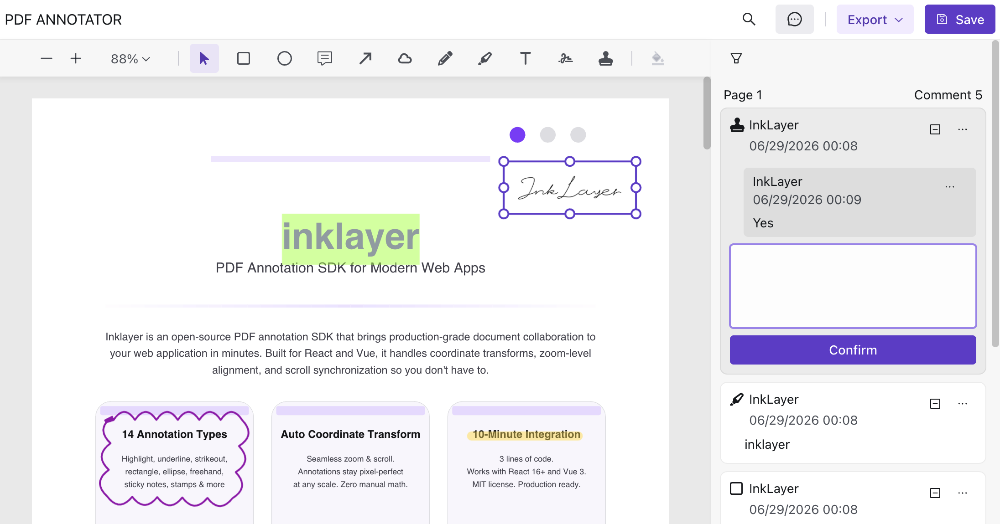

<p align="center">
  
</p>

<h1 align="center">InkLayer React</h1>

<p align="center">
  <a href="./README.md">简体中文</a> <span>&nbsp;&nbsp;|&nbsp;&nbsp;</span>
  <a href="./README-en-US.md">English</a>
</p>

<p align="center">
  🖊️ A React PDF viewer & annotation SDK built on PDF.js<br/>
  For building document review, annotation, and commenting systems
</p>

<div align="center">
  <a href="https://www.npmjs.com/package/inklayer-react" target="_blank">
    
  </a>
  <a href="./LICENSE" target="_blank">
    
  </a>
</div>

<br/>

<div align="center">
  <a href="https://laomai-codefee.github.io/inklayer-react/" target="_blank"><b>🔥 Live Demo</b></a>
  <span>&nbsp;&nbsp;|&nbsp;&nbsp;</span>
  <a href="https://inklayer.dev/docs" target="_blank"><b>📚 Docs</b></a>
  <span>&nbsp;&nbsp;|&nbsp;&nbsp;</span>
  <a href="https://github.com/Laomai-codefee/inklayer-react" target="_blank"><b>⭐ GitHub</b></a>
</div>

---

<p align="center">
  
</p>

## ⭐ Quick Start (Recommended)

The fastest way to try InkLayer React: use the [official starter 🚀 ](https://github.com/Laomai-codefee/inklayer-react-starter).

```bash
git clone https://github.com/Laomai-codefee/inklayer-react-starter.git
cd inklayer-react-starter
npm install
npm run dev
```

Open:

http://localhost:5173

> 💡 The starter comes with a complete PDF annotation example pre-configured — no extra setup needed to experience the full SDK.

---

## ✨ Features

- 🚀 PDF Viewer (zoom / search / theming)
- 🖍️ PDF Annotation System (highlight / ink / shapes / stamps / signatures)
- 💬 Comment & review workflow
- 💾 Annotation data model (persistable)
- 📤 Export support (PDF / Excel)
- 🎨 Customizable UI (toolbar / sidebar)

---

## 📦 Installation

```bash
npm install inklayer-react
```

---

## 🚀 Basic Usage

### PdfAnnotator (annotation)

```jsx
import { PdfAnnotator } from 'inklayer-react'
import 'inklayer-react/style'

export default function App() {
  return (
    <PdfAnnotator
      title="PDF Annotator"
      url="https://example.com/sample.pdf"
      user={{ id: 'u1', name: 'Alice' }}
      onSave={(annotations) => {
        console.log('Saved annotations:', annotations)
      }}
    />
  )
}
```

---

### PdfViewer (viewer)

```jsx
import { PdfViewer } from 'inklayer-react'
import 'inklayer-react/style'

export default function App() {
  return (
    <PdfViewer
      title="PDF Viewer"
      url="https://example.com/sample.pdf"
      layoutStyle={{ width: '100vw', height: '100vh' }}
    />
  )
}
```

---

## 📖 API Docs

👉 https://inklayer.dev/docs/react

---

## 🔐 Collaborative Annotation Permissions

`user` identifies the current user; callers do not need to provide a separate `role`. In `owner-only` mode, authenticated users may create annotations and replies, while only the annotation owner may move, resize, edit, change status, or delete that annotation. A reply can be edited or deleted only by its author.

```tsx
<PdfAnnotator
  user={{ id: currentUser.id, name: currentUser.name }}
  annotationPermissions={{
    mode: 'owner-only',
    can: ({ currentUser }) =>
      currentUser?.id === 'admin' ? true : undefined
  }}
/>
```

The optional synchronous `can(request)` resolver overrides the mode: return `true` to allow, `false` to deny, or `undefined` to keep the mode's default decision. The request includes `action`, `currentUser`, `annotation`, `comment`, and `defaultAllowed`, so applications can add administrator, workflow-state, or document-level rules.

For a fully read-only annotator, pass `annotationPermissions={{ can: () => false }}`. Users can still select and inspect annotations, while every mutation is denied.

> These are browser interaction permissions for InkLayer UI and local mutations. Your backend API must still authorize every read and write; client-side decisions are not a security boundary.

---

## 🔗 Related Projects

- InkLayer Vue: https://github.com/Laomai-codefee/inklayer-vue
- Vue Starter: https://github.com/Laomai-codefee/inklayer-vue-starter
- React Starter: https://github.com/Laomai-codefee/inklayer-react-starter

---

## 💬 Feedback

Questions? Feature requests? Drop by [GitHub Discussions](https://github.com/Laomai-codefee/inklayer-react/discussions) or email us: [codefee@foxmail.com](mailto:codefee@foxmail.com)

Bug reports → [GitHub Issues](https://github.com/Laomai-codefee/inklayer-react/issues)

---

## 🌐 Runtime Environment

InkLayer React is browser-only and does not support server-side rendering (SSR). Its components depend on the DOM, Canvas, and Web Workers, so import and render them only in client-side code.

- Supports React 18 and React 19
- Supports Vite and Webpack 5
- Provides both ESM and CommonJS entry points; ESM is recommended
- In isomorphic frameworks such as Next.js or Remix, keep the components behind a client boundary and disable SSR for them

---

## 📄 License

MIT © InkLayer
